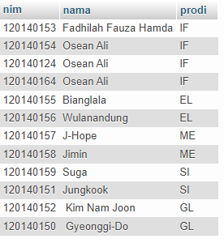
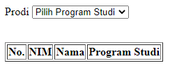
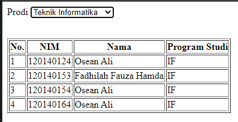

# Pertemuan 5

Praktikum Pemrogram Web RB
 Jadwal A

Fadhilah Fauza Hamda-120140153

Berikut hasil dari tugas yang dikerjakan

- Data Tabel
   Data berjumlah 11 data mahasiswa 
  
- Hasil Awal
   Sesuai dengan soal bahwa saat pertama kali dijalankan data yang tampil akan kosong 
  
- Hasil Akhir
   Hasil akan tampil sesuai dengan option yang dipilih 
  
